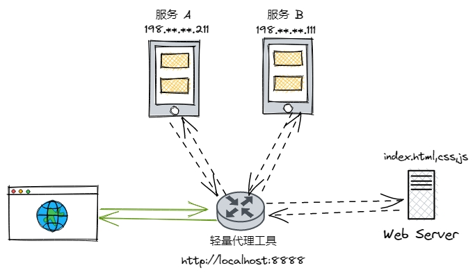
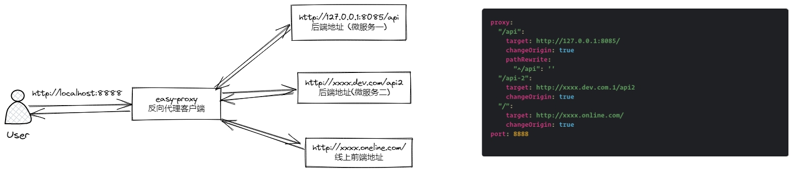

# easy-proxy

一个简单而实用的`超轻量代理工具`。

## 反向代理

反向代理是个轻量服务，你向他请求，他将请求转发给其他服务并将响应返回给你。大聪明给你举个例子：你可以将反向代理类比为互联网大厂的小组长。

有啥用？？可以用代理工具随意的搭配开发环境。
`
下图中可以将服务A、服务B、Web Server任意一个替换成本地服务，然后通过访问 `代理服务地址` 进行调试。



## easy-proxy 使用方法

step 1: 下载资源包 

step 2: 修改配置文件，easy-proxy.yml

```yml
proxy:
  # 后端服务 A 的公共路径, 使用 /api 进行匹配
  "/api":
    # 本地服务地址
    target: http://127.0.0.1:8085/
    changeOrigin: true
    # 接口前缀和线上保持一致。表示接口上线后加了统一前缀 /api, 本地服务需要替换掉
    pathRewrite:
      "^/api": ''

  # 后端服务 B 的公共路径, 使用 /api-2 进行匹配
  "/api-2":
    target: http://xxxx.dev.com.1/api2
    changeOrigin: true
  # 前端静态资源地址
  "/": 
    target: http://xxxx.online.com/
    changeOrigin: true
# easy-proxy 服务端口，启动后，使用 http://localhost:8888/ 
port: 8888
## headers 是 request header, 可以实现免登录。用不上请把 headers 注释掉
headers:
  Authorization: replace this token string
```

step 3: 启动程序，保持运行不要关闭。

写不下去了，再贴张图凑下篇幅。


## 使用场景

场景一： 后端改造，复杂请求想用下前端界面请求本地。使用 easy-proxy 配置两条规则（前端静态资源，本地服务）即可

场景二： 前端巨型项目 npm run dev 超慢，和不同后端地址联调时需要频繁等待 npm run dev。使用 easy-proxy 只需改下配置，秒起。其实 easy-proxy 的原理就是将 webpack 的 proxy 解耦了出来。前端的小伙伴应该可以秒懂。

场景三：纯后端接口场景，A服务想请求 B服务的（dev, staging, production, 泳道A、B、C）假想的场景。😂


